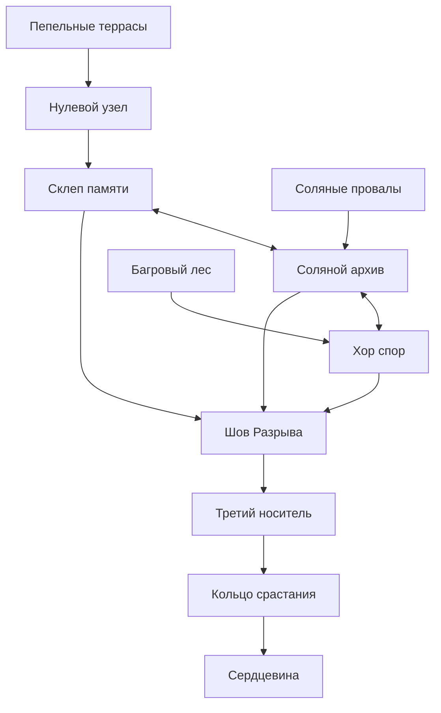

# CYBERMYCELIUM — карта планеты и гробницы

Версия рабочего канона: 1.3. Эта карта описывает весь первый сюжетный цикл. Все одиннадцать основных областей и малая Камера сопряжения доступны в игре; затемнение на игровой карте означает сюжетный запор.

## Масштаб и ориентация

Планета пока не получила собственного имени. Древняя грибница возникла естественно, проросла через леса, соли и вулканический пепел и постепенно стала **единым мыслящим организмом планетарного масштаба**. Проводящие нити и память — её собственные биологические механизмы. Позднее создатели добавили терминалы PRIMUS. Мышление грибницы распределено; отдельные ветви сохраняют собственную память и не знают всего одновременно. Гробница — построенная вокруг сходящихся корней система каменных залов и запечатанных ветвей. «Центр» означает сердцевину сети, а не географический центр планеты или место единственного мозга. Игровая карта показывает **связность и глубину**, не километры и стороны света.

Маг прибыл с другой планеты в Пепельные террасы. Новая игра начинается здесь; старые сохранения продолжаются в прежнем зале.

## Узлы и маршруты

| ID | Область | Слой | Назначение в сюжете | Состояние |
|---|---|---|---|---|
| A0 | Пепельные террасы | Дальняя поверхность | Место прибытия; прибор хранит ранний сигнал мага, пепел — след из грибницы | Игра |
| A1 | Нулевой узел / Внешний предел | Вход в гробницу | Первый след создателей; боковая Камера сопряжения и переходник для терминала | Игра |
| A2 | Склеп памяти | Внутренний коридор | Образец спор, свидетель и первый выбор контакта | Игра |
| B0 | Соляные провалы | Дальняя поверхность | Вода меняет проводимость обхода; срез и отвод дают задержку | Игра |
| B1 | Соляной архив | Боковая ветвь | Фильтр, керн и хронометр дают независимый порядок отсечения | Игра |
| C0 | Багровый лес | Дальняя поверхность | Ветер и две фазы ламелл; раздельный щадящий отбор | Игра |
| C1 | Хор спор | Боковая ветвь | Клапан разводит возраста; резонатор проверяет путь раннего голоса | Игра |
| X | Шов Разрыва | Кольцо схождения | Сравнение официальной хроники и иного порядка событий | Игра |
| T | Третий носитель | За запечатанной аркой | Поздняя печать поверх живой памяти; связь голоса с сигналом мага без вывода об авторстве | Игра |
| R | Кольцо срастания | Внутреннее кольцо | Три ветви сходятся; проба усреднения показывает потерю местной детали | Игра |
| H | Сердцевина | Глубина | Пропавшие хозяева, намерение живого разума, процессор и выбор режима | Игра |

### Соединения

- Главный существующий путь: A1 → A2 → X. Выбор «слушать» или «изолировать» меняет доступ к свидетельству и реплики, но обе ветви достигают X.
- Подходы с дальних мест: A0 → A1; B0 → B1 → X; C0 → C1 → X.
- Боковые нити: A2 ↔ B1 и B1 ↔ C1. Из Склепа памяти в соль можно войти после чтения Третьего носителя; влажный мост между солью и Хором пропускает мага после независимых выводов обеих ветвей и восстановления живой переправы. Эти физические переходы показывают, что грибница — сеть, а не один коридор.
- Путь в глубину: X → T → R → H. До T нельзя попасть, пока не сопоставлены две записи у Шва. В T можно исследовать носитель сразу, но вывод о происхождении голоса остаётся неполным до независимых проверок B и C. В R нужны свидетельства всех трёх дальних ветвей; игроку не требуется пройти их в одном заданном порядке.
- Обратное движение между открытыми залами сохраняется. Грибница передаёт сигналы между далёкими узлами, но не телепортирует тело мага.

**Масштаб сцен:** Камера сопряжения — подлокация A1, а не двенадцатая область планеты. В неё входят через боковой проём Нулевого узла и возвращаются к тому же терминалу. Каждый большой узел может иметь малые комнаты с одной конкретной задачей; карта мира показывает только основные области.

## Схема прохождения

## Что соединяет места

1. **Материальная нить.** Корни пробивают камень и образуют настоящие проходы. На уровне игрока связь видна как сеть белых волокон, уходящих из кадра в соседний зал.
2. **Память и мысль.** Химические сигналы и споры несут неполные отпечатки между отдалёнными частями одного организма. Связь позволяет планете мыслить, но её части сохраняют разные точки зрения. Одна запись не может служить окончательным доказательством; маг сравнивает независимые носители.
3. **Пульс центра.** По мере приближения к H частота пульсов совпадает в разных ветвях. Это навигационный признак, а не голос, отдающий приказы. Источник пульса в рабочем каноне — контакт древней грибницы с квантовым процессором в сердцевине; ранний герой этого ещё не знает.
4. **След Разрыва.** Отсечённые магистрали и исправленные записи объясняют закрытые пути. Восстановление открывает новый участок, но также может вновь передать опасный сигнал.

## Порядок открытия

- A0, A1 и A2 ведут к Шву X. Изолированный или принятый внешний ответ не закрывает эту дорогу. Новая игра начинается с A0; старое сохранение продолжает прежний маршрут.
- T открывается после сопоставления у Шва. Прочтение его печати, резонатора и капсулы открывает боковые физические проходы к B1 и C1. B0 доступен через сухую арку B1, C0 — через тропу C1. Ветви исследуются в любом порядке: соль уточняет время, споры — путь раннего голоса.
- Свидетельства T, B и C открывают затвор в R. В кольце маг сохраняет происхождение трёх линий, затем входит в H; пробное стирание детали и ограничение обмена происходят у видимых объектов кольца.
- A0 — пролог и возможный возврат на поверхность. Он объясняет прибытие, но не становится обязательным препятствием для старого сохранения.

## Ограничение масштаба для экранов

Каждый будущий экран должен иметь: место на карте, вход и выход с видимой нитью, один новый проверяемый факт, одно действие мага и последствие для соседнего узла. Никаких изолированных «красивых комнат»: они должны менять понимание маршрута или состояние сети.

Устройство и биология центральной камеры описаны отдельно в [CORE_LORE.md](CORE_LORE.md). Эта информация не раскрывается раньше внутриигровых свидетельств.
